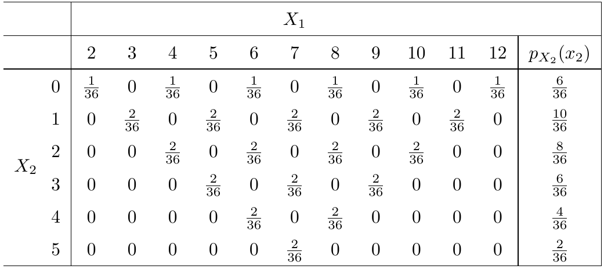
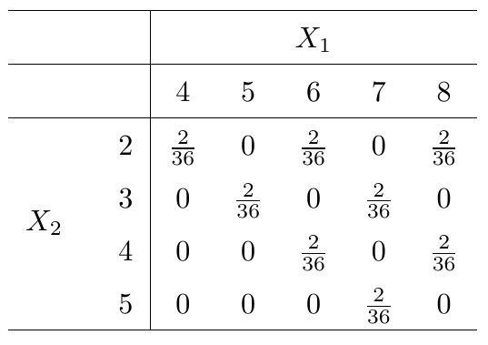
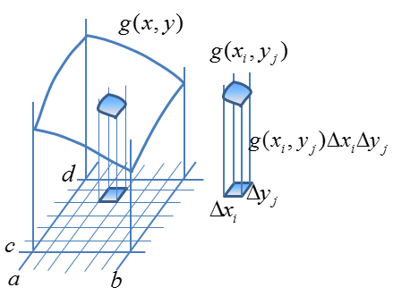
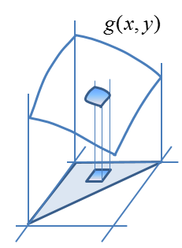
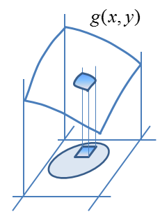

\newcommand\given[1][]{\:#1\vert\:}
\newcommand\P[1]{P{\left(#1\right)}}
\newcommand\F[1]{F_{\tiny{#1}}}
\newcommand\f[1]{f_{\tiny{#1}}}
\newcommand\p[1]{p_{\tiny{#1}}}

# probabilities involving more than one random variable at a time

## motivation

A random variable is a function of a sample space, and we care about its distribution.

So far we've focussed on $X:S \to \mathbb{R}$.

Now we will look at $X:S \to \mathbb{R}^n$, which arise quite naturally. We've actually been doing this already sometimes, without saying so explicitly (see Case 2).

Case 1: you *actually observe* multiple things about a particular random outcome (e.g. you measure the weight and blood pressure of a randomly selected study participant.)

Case 2: you are considering a sequence of random variables that "replicate" the same "experiment" (e.g. repeat a Bernoulli($p$) trial $n$ times...) 

## discrete motivating example { .build }

Toss two fair six-sided dice. The sample space has 36 elements. 

Observe the total and the difference.

Denote the total by $X_1$ and the difference by $X_2$, and $X = (X_1, X_2)$

$X:S \to \mathbb{R}^2$ is a random variable and we can consider probabilities of the form $P(X \in A_1 \times A_2) = P(X_1 \in A_1, X_2 \in A_2)$ for $A_i \subset \mathbb{R}$. All such probabilities together form the "distribution" of $X$. 

But this is an excess of formality. Normally we work directly with the components, in this case $X_1$ and $X_2$, which are two discrete rvs and we can put probabilities of combinations of outcomes in a table.

## table of probabilities

## "joint" distribution

\<*Insert cannabis joke here*\>

Such a table summarizes the distribution of $X$, which we'll just call the *joint distribution* of $X_1$ and $X_2$.

The table has all the values of the form $p(x_1, x_2) = P(X_1=x_1, X_2=x_2)$ and is called the *joint* probability mass function.

A joint pmf is non-negative, and its positive values sum to 1 (just like before).

The joint cdf is defined as: $P(X_1 \le x_1, X_2 \le x_2)$ for all $(x_1, x_2) \in \mathbb{R^2}$. 

It is non-decreasing and right-continuous in both variables, and goes to 0 and 1 as both dimensions go to $\pm\infty$ respectively. 

## marginal distributions

The pmf of any of the component random variables can be recovered by summing over all the others, e.g.:
$$\p{X_1}(x_1) = \sum_{x_2}p(x_1, x_2),$$
(where $\sum_{x_2}$ denotes summing over all values that $X_2$ takes on.)

This is called a *marginal* pmf, which characterizes the distribution of that random variable. 

## example: marginal for $X_2$

# volumes under surfaces

## discrete analogue 

First, consider calculating in the discrete example:

$$P(4\le X_1 \le 8,\, 2 \le X_2 \le 5)$$

## "double integral" crash course - I

A double ("Riemann") integral calculates the volume between the a rectangle $[a,b] \times [c,d]$ in the $xy-$plane and a function $g(x,y)$ in pretty much the same way $\int g(x)$ calculates the area under a curve.

  
  $$\int\limits_a^b\!\int\limits_c^d g(x,y)\,dx\,dy \approx \\
  \sum\limits_{i,\,j} g(x_i, y_i)\Delta x_i\Delta y_i$$

  
## double integral crash course - II

In general the same idea applies to a volume between any region $B \subset \mathbb{R}^2$ and $g(x,y)$. 

  
  
  
  
  $$\iint\limits_B g(x,y)\,dx\,dy$$

## double integrals crash course - III

Two basic properties:

$$\iint\limits_B \left[\alpha_1 g_1(x,y) + \alpha_2 g_2(x,y)\right]\,dx\,dy = \\
\alpha_1\iint\limits_B  g_1(x,y) \,dx\,dy + \alpha_2\iint\limits_B  g_2(x,y) \,dx\,dy$$

When $B_1$ and $B_2$ are disjoint:

$$\iint\limits_{B_1 \cup B_2} g(x,y) \,dx\,dy = \\
\iint\limits_{B_1}  g(x,y) \,dx\,dy + \iint\limits_{B_2}  g(x,y) \,dx\,dy$$

## double integrals crash course - IV { .build }

The actual calculation is just done one variable at a time, from the inside out (first holding the outside variable "constant")

Simple example ($B$ is a  rectangle): $g(x, y) = xy^2$. Consider:

$$\int\limits_0^2\!\int\limits_1^3 xy^2 \,dx\,dy$$

And it makes no difference which order, but be careful when $B$ is not a rectangle. Consider the integral of $g$ over the region bounded by $x=0$, $y=0$, and $x + y = 1$. 

## joint continuous distributions { .build }

Reconsider measuring the weight $X$ and (systolic) blood pressure $Y$ of a randomly selected study participant. We'll be interested in things like:

$$P(70 < X < 80, 120 < Y < 140)$$

In this case $X$ and $Y$ are both continuous random variables. A fancy way to re-write the above would be to let $A = [70, 80]\times[120, 140]$ and get:

$$P((X,Y) \in A)$$

Definition: $X$ and $Y$ are *jointly continuous* if there is a $f(x,y)$ such that, for "all" $A \subset \mathbb{R^2}$

$$P((X,Y) \in A) = \iint\limits_A f(x,y)\,dx\,dy$$

## joint density { .build }

The function $f(x,y)$ is called the *joint density*, and is used to calculate probabilities.

Properties: $f \ge 0$ and $\iint\limits_{\mathbb{R^2}}f(x,y)\,dx\,dy = 1$

Example 1: $f(x,y) = 1$ on $0 < x,\,y < 1$ and 0 otherwise. ("Joint Uniform") Is this a density? Calculate: $P(X < 1/2, Y < 1/2)$ and $P(X < Y)$. 

Example 2: (artificial) $f(x,y) = cxy$ on $0 < x < 1$, $0 < y < 2$, and 0 otherwise. Determine $c$. Calculate $P(X > 0.5, 0 < Y < 1)$ and $P(Y > X)$. 

